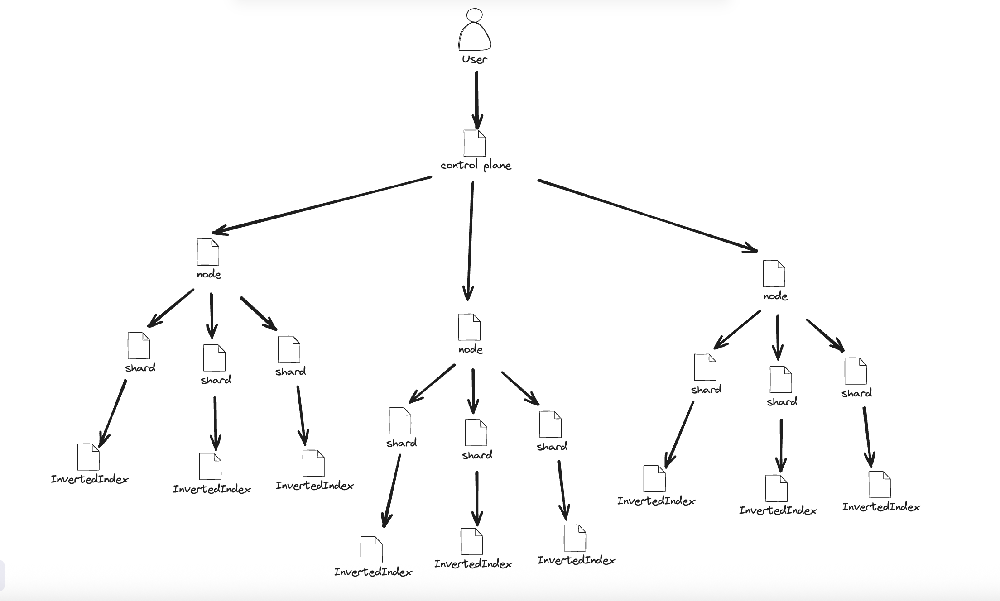

# ingenium-logs-filtering

This project implements a **lightweight, in-memory distributed search engine** built around the concepts of:

* **Hierarchical clustering of indexes** (`Node → Shard → InvertedIndex`)
* **Efficient text indexing and lookup**
* **Prefix-based autocomplete (suggestions)**
* **Asynchronous trie rebuilds**
* **Concurrent document ingestion and search**

* for educational purposes

The design is optimized for horizontal scalability and minimal synchronization overhead — using `ConcurrentHashMap`, lock-free queues, and a dedicated executor service for background updates.

## Architecture

- 


## Overview


Each layer implements the same `SearchEntry` interface, which defines basic operations:

```java
public interface SearchEntry {
    boolean addDocument(String name, String text);
    Map<String, AtomicLong> searchDocuments(String query);
    List<String> suggest(String prefix, int limit);
    int size();
}
```

### Responsibilities by Level

| Class                       | Role                    | Responsibilities                                                          |
| --------------------------- | ----------------------- | ------------------------------------------------------------------------- |
| **InvertedIndexEntry**      | Atomic text index       | Index individual documents, manage a local Trie for search & autocomplete |
| **ShardClusterEntry**       | Shard controller        | Manage multiple InvertedIndexes, roll over to frozen indexes when full    |
| **NodeClusterEntry**        | Node-level orchestrator | Aggregate multiple shards, coordinate search and indexing across them     |
| **ClusterEntry (abstract)** | Base abstraction        | Common concurrent logic for shard rotation and distributed searching      |

---

## 🔍 `InvertedIndexEntry` – The Core Index

`InvertedIndexEntry` is the fundamental building block — it represents a small, self-contained inverted index that stores mappings between **words → documents → occurrence counts**.

It combines two data structures:

1. **Aho–Corasick Trie** (`org.ahocorasick.trie.Trie`) for efficient multi-pattern search
2. **Patricia Trie** (`org.apache.commons.collections4.trie.PatriciaTrie`) for prefix-based autocomplete

### Key Components

| Field                           | Type                                   | Description                               |
| ------------------------------- | -------------------------------------- | ----------------------------------------- |
| `indexedMap`                    | `Map<String, Map<String, AtomicLong>>` | Word → (Document → Frequency)             |
| `trieBuilder` / `lastBuiltTrie` | Aho-Corasick trie builder & snapshot   | Enables fast multi-word search            |
| `suggestions`                   | `PatriciaTrie<Boolean>`                | Used for prefix-based completion          |
| `trieUpdateQueue`               | `ConcurrentLinkedQueue<String>`        | Pending words to insert into Trie         |
| `trieUpdateInProgress`          | `AtomicBoolean`                        | Controls async update concurrency         |
| `TrieUpdater`                   | Dedicated background executor          | Manages trie rebuild tasks asynchronously |

---

### 🧠 Functional Flow

#### 1. **Adding Documents**

```java
addDocument(String name, String text)
```

* Parses the input text into lowercase tokens.
* Updates the inverted index (`indexedMap`).
* Enqueues new tokens into the trie update queue.
* Triggers an asynchronous trie rebuild after every 10th insertion or once the queue exceeds 500 items.

#### 2. **Searching Documents**

```java
searchDocuments(String query)
```

* Uses the Aho–Corasick trie to efficiently find all indexed words contained in the query.
* Merges the frequency maps of all matched words into a single result set.
* Returns a `Map<DocumentName, AtomicLong>` representing the total term frequency per document.

#### 3. **Suggestions**

```java
suggest(String prefix, int limit)
```

* Uses the `PatriciaTrie` for prefix search.
* Returns up to `limit` keyword suggestions starting with the given prefix.

#### 4. **Asynchronous Trie Updates**

```java
TrieUpdater.INSTANCE.updateEventually(this);
```

* Submits the index to a background `ExecutorService` for incremental trie rebuild.
* Ensures that indexing never blocks due to trie updates.
* The update logic consumes the queue and rebuilds the `Trie` snapshot atomically.

---

## ⚙️ Cluster Logic (`ClusterEntry`)

`ClusterEntry<T extends SearchEntry>` defines shared concurrency and rollover logic for higher-level components (`ShardClusterEntry`, `NodeClusterEntry`).

It manages two concurrent maps:

* `active`: current working indexes (or shards)
* `frozen`: rolled-over indexes once their internal capacity is reached

### Key Logic

```java
if (entry.size() >= entriesSize) {
    frozen.computeIfAbsent(shardNumber, k -> new ConcurrentLinkedQueue<>()).add(entry);
    entry = createEntry();
    active.put(shardNumber, entry);
}
```

When an active index reaches its maximum capacity (`entriesSize`), it’s moved to the frozen pool and replaced with a new one.
This allows continuous ingestion without pauses or reallocation delays.

---

## ⚡ Parallelism & Concurrency Model

### 1. **Read Path (Search)**

* Search operations use **stream-based reduction**, merging partial results from all active and frozen indexes.
* Future optimization: controlled parallelism using a fixed-size `ExecutorService` with task batching.

### 2. **Write Path (Indexing)**

* All write operations use **lock-free data structures** (`ConcurrentHashMap`, `ConcurrentLinkedQueue`).
* Trie rebuilds happen asynchronously in a separate thread pool managed by `TrieUpdater`.

### 3. **Background Processing**

* The `TrieUpdater` class runs a dedicated fixed thread pool proportional to CPU cores.
* On JVM shutdown, it automatically shuts down gracefully via a shutdown hook.

---

## Design Principles

1. **Lock-Free First** — rely on atomic operations, concurrent collections, and compare-and-set flags.
2. **Asynchronous Trie Rebuilds** — indexing never waits on the trie update.
3. **Hierarchical Scalability** — multi-level structure allows easy horizontal scaling.
4. **Immutable Search Snapshots** — `lastBuiltTrie` guarantees consistent search view during rebuilds.
5. **Separation of Concerns** — indexing, searching, and trie updates are logically isolated.

---

## Future Improvements

| Area                             | Description                                                                                       |
|----------------------------------| ------------------------------------------------------------------------------------------------- |
| **LRU Caching for Reads**        | Introduce `ConcurrentLinkedHashMap` for hot-page caching and prefetching.                         |
| **Disk Spill for Frozen Shards** | Serialize old `frozen` indexes when exceeding capacity.                                           |
| **Controlled ThreadPool Search** | Replace `parallelStream()` with fixed executor for predictable CPU usage. |
| **Bloom Filters per Shard**      | Fast pre-check to skip irrelevant shards during global search.                                    |
| **Monitoring & Metrics**         | Add JMX or Micrometer metrics for throughput, latency, and trie rebuild stats.                    |

---

## 📚 Dependencies

| Library                                   | Purpose                                                      |
| ----------------------------------------- | ------------------------------------------------------------ |
| `org.ahocorasick:ahocorasick`             | Multi-pattern text search (Trie)                             |
| `org.apache.commons:commons-collections4` | PatriciaTrie for autocomplete                                |
| `java.util.concurrent`                    | Concurrency primitives (Executors, atomics, concurrent maps) |

---

## 🧩 Example Usage

```java
NodeClusterEntry node = new NodeClusterEntry();

// Index some documents
node.addDocument("doc1", "fast search engine built in java");
node.addDocument("doc2", "java engine for distributed search");

// Search
Map<String, AtomicLong> result = node.searchDocuments("java search");

// Suggest
List<String> suggestions = node.suggest("sea", 5);
```

---

## Performance Notes

* **Indexing throughput**: scales linearly with number of cores (lock-free path)
* **Search latency**: O(K) where K = number of matching shards (parallelizable)
* **Memory footprint**: proportional to unique tokens (each stored once per shard)
* **Autocomplete latency**: sub-millisecond for small to medium dictionaries
